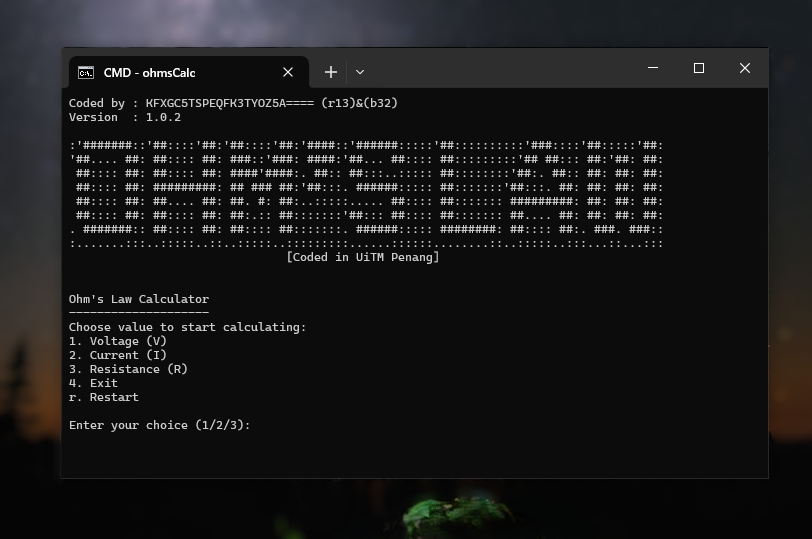

# Ohm's Law Calculator (English Version) 1.0.2
Ohm's Law Calculator for windows (CLI)

Don't forget to give a star above or follow me or do both.

No Installation needed just run it properly after downloading.

# Screenshot

# Download

# Features Update 1.0.2
- Exit option
- Restart option
- Calculate Voltage
- Calculate Resistance
- Calculate Current

# Info
- One time using, open it again for use it again.
- This non stable yet, i will fix and make improvements for this tool.
- Version 1.0.2 coming up

# Source Code
[View the source code](https://hakimdaniel.github.io/ohmslaw/src/main.c)

# Credit
- Daniel Hakim
